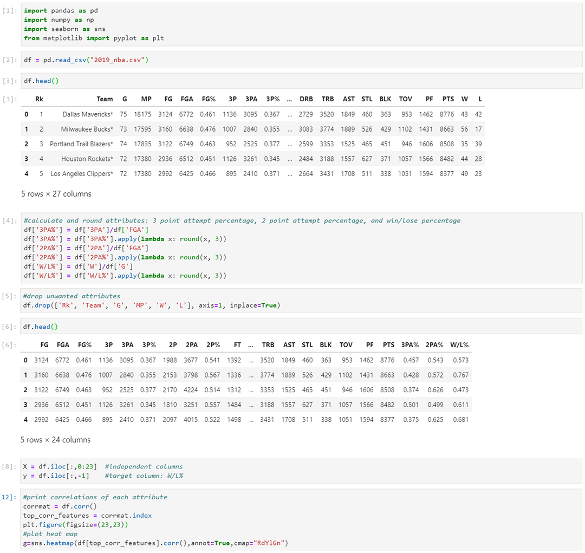
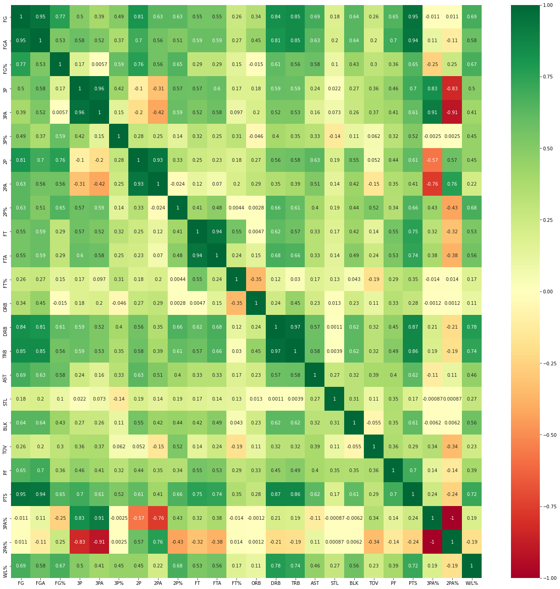
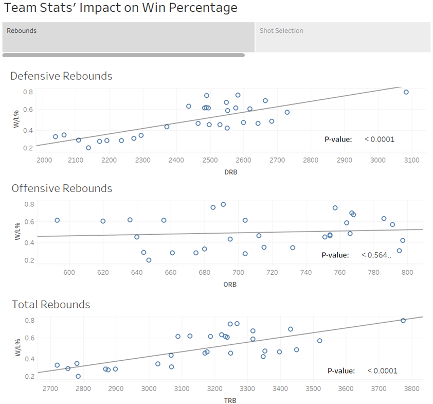
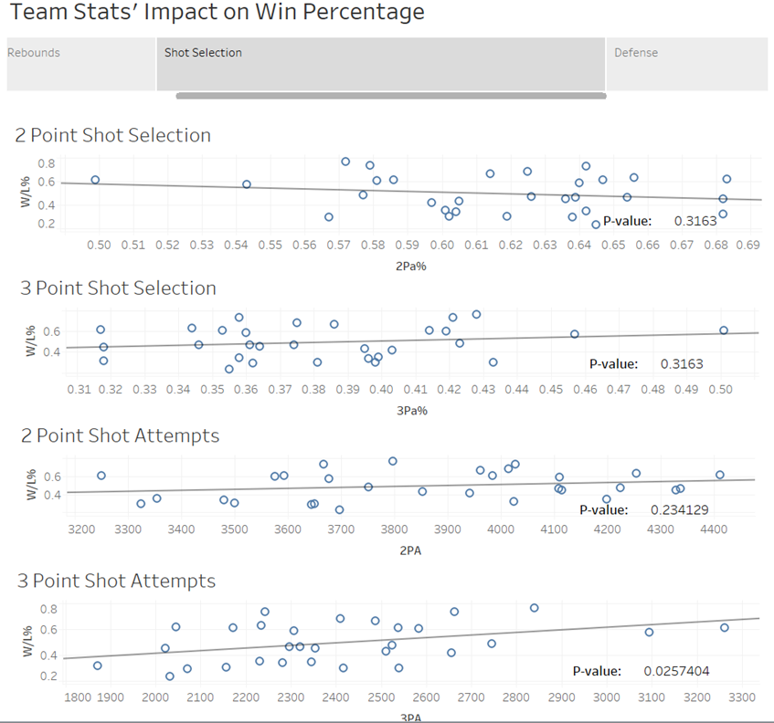
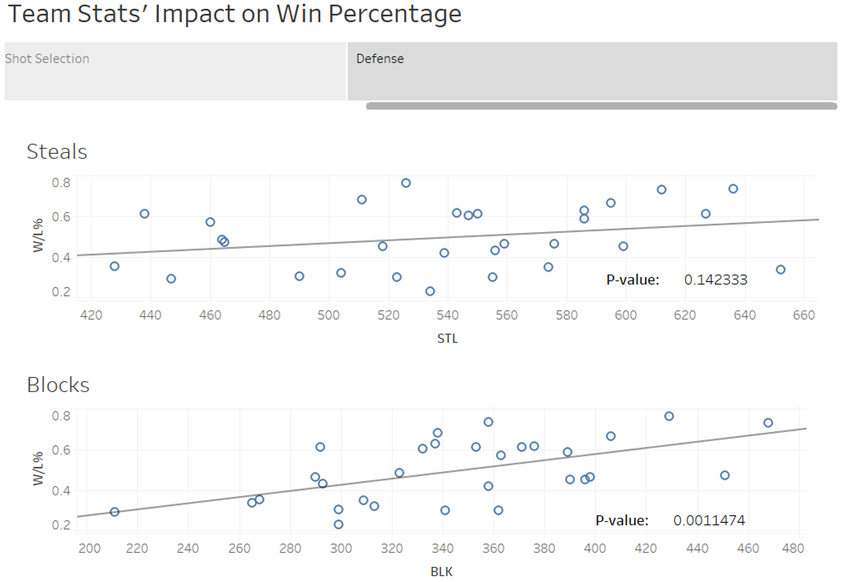

# Ben Landerman's Samples of Work

## Data Analysis and Visualization README

### Sample of Data Analysis and Visualization with Python and Tableau

*Links to Code:*
- [Data Cleaning and Heat Map](nba_code.py "Data Cleaning and Heat Map")

#### Screenshots of running code:
| *[Data Cleaning](nba_code.py "Data Cleaning")* | *[Heat Map](nba_code.py "Heat Map")*          |
|:---------------------------------------------: |:---------------------------------------------:|
|         |                   |

#### Screenshots of Tableau Story:
| *Story Page 1* | *Story Page 2*          | *Story Page 3)*          |
|:---------------------------------------------: |:---------------------------------------------:|:---------------------------------------------:|
|         |                   |                   |