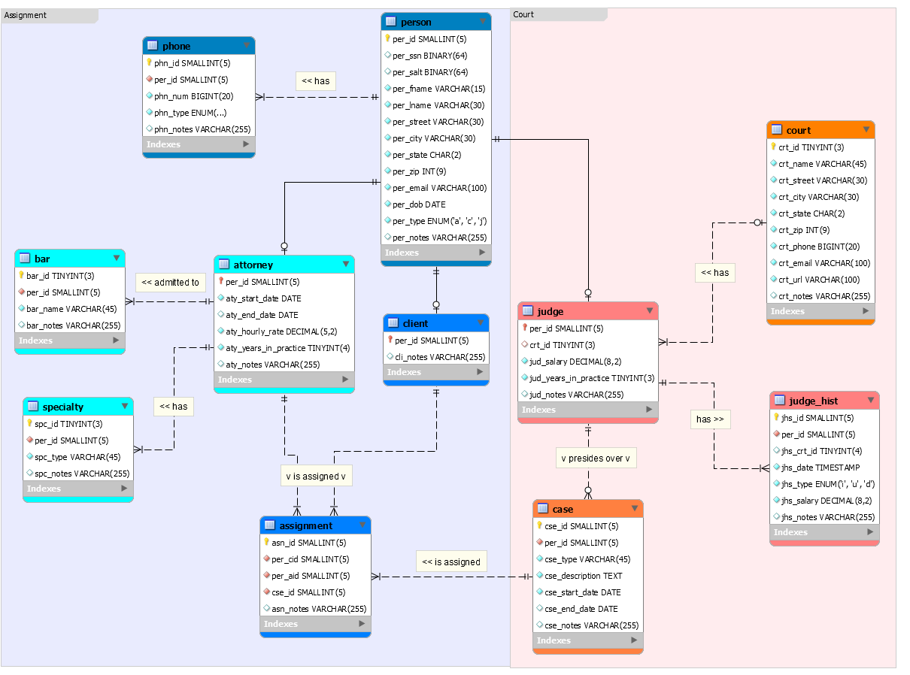
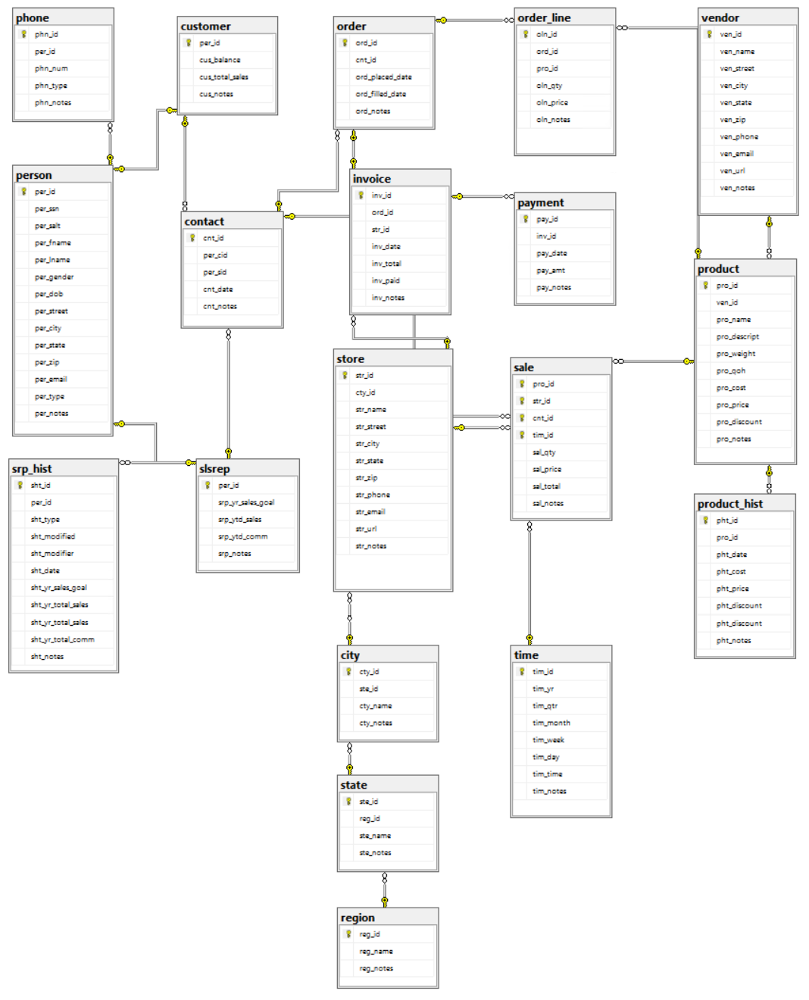

# Ben Landerman's Samples of Work

## Data Modeling and Database Development README

### Sample of Data Modeling and Database Development with SQL Server and MySQL

*Links to Code:*
- [Court Database (MySQL)](court_database.sql "Court Database")
- [Court Queries (MySQL)](court_queries.sql "Court Queries")
- [Office Supply Database (SQL Server)](office_supply_database.sql "Court Database")
- [Office Supply Queries (SQL Server)](office_supply_queries.sql "Court Queries")

#### Screenshots of ERDs:

| *Court Database (MySQL)*                          | *Office Supply Database (SQL Server)*                           |
|:---------------------------------------------:|:---------------------------------------------:|
|                |                  |